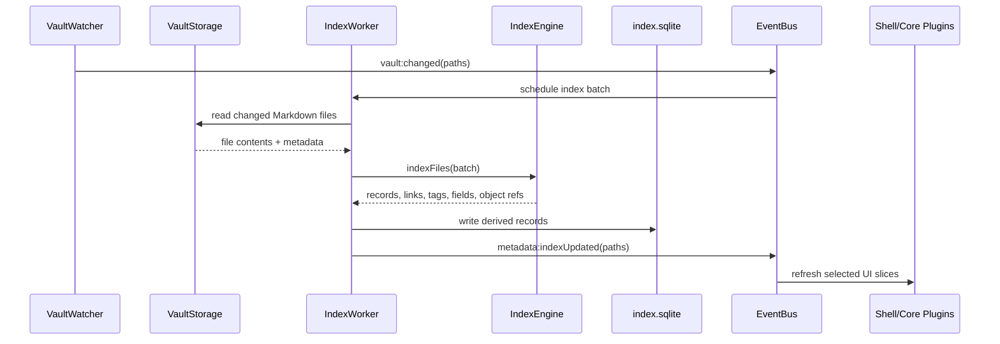

Zorid stores derived metadata in `.zorid/index/index.sqlite`. The index is **rebuildable at any time** from canonical Markdown, `.zbase`, and `.ztype` files.

## Tables (v0)

| Table | Purpose |
| --- | --- |
| `files` | One row per Markdown file: path, mtime, hash, title, frontmatter blob |
| `fields` | Normalized field values per file, with inferred and declared types |
| `tags` | Tag occurrences and counts |
| `links` | Wiki/Markdown link edges (source path → target path or unresolved target) |
| `embeds` | Embedded paths (including `.zbase`) per file |
| `headings` | Outline entries with depth and offset |
| `types` | Resolved `.ztype` definitions and field schemas |
| `views` | `.zbase` base \+ view metadata; renderer config stored as `config_json` |

## Indexing flow

## IndexEngine contract

`packages/index-api` defines the `IndexEngine` interface. `packages/indexer-js` provides the v0 reference implementation. `crates/index-core` \+ `crates/index-wasm` are reserved for a later Rust acceleration layer behind the same contract.

<Card title="Source" icon="github" href="https://github.com/zorid-app/Zorid/blob/main/docs/architecture/index-schema.md">
  Full index schema and migration rules on GitHub.
</Card>