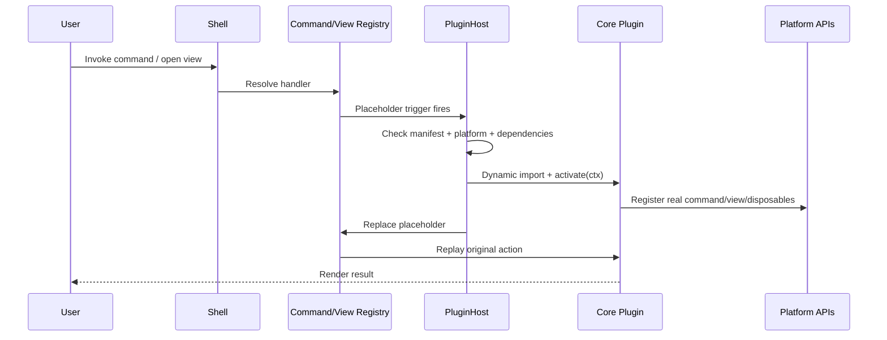

## Kernel vs plugin host

```text
Kernel
  non-disableable app OS: lifecycle, services, events, commands, settings, capabilities

Plugin Host
  extension runtime: manifests, platform checks, dependency graph, lazy triggers,
  permissions, cleanup, error isolation

Platform APIs
  typed public surfaces: vault, workspace, editor, metadata, objects/.zbase, search, storage

Shell
  app control UI: command palette, settings, main layout, plugin manager

Core plugins
  official bundled features under plugins/core
```

## Lifecycle-owned cleanup

Every plugin contribution registers through lifecycle-owned APIs and returns a disposable. The plugin host disposes registered resources in reverse order on unload or failure.

```ts
ctx.register.command(command);
ctx.register.event(ctx.events.on("vault:file-created", handler));
ctx.register.viewRenderer(renderer);
ctx.register.domEvent(element, "click", handler);
ctx.register.interval(intervalId);
```

Cleanup applies to commands, settings schemas, views, `.zbase` renderers, Markdown processors, editor extensions, event listeners, DOM listeners, timers, metadata subscriptions, status items, and exported plugin APIs.

## Platform split

Manifests declare where a plugin runs and which capabilities it needs:

```json
{
  "platforms": ["desktop", "mobile"],
  "capabilities": {
    "required": ["vault.read", "workspace.views", "metadata.read"],
    "optional": ["haptics", "nativeShare"]
  }
}
```

- Default to cross-platform where possible.
- Declare desktop-only or mobile-only support explicitly.
- Native features go through Zorid platform APIs, not raw Electron/Node/Capacitor.
- Incompatible plugins are hidden, disabled, or shown with a clear reason.

## Plugin dependency model

Dependencies are first-class because core plugins like Fields and Data Views are meant to become extension platforms.

```json
{
  "dependsOn":         { "zorid.core.fields":     "^0.1.0" },
  "optionalDependsOn": { "zorid.core.data-views": "^0.1.0" }
}
```

```ts
const fields = await ctx.plugins.getApi("zorid.core.fields");
```

Dependencies enable deterministic load order, lazy activation of dependency graphs, compatibility checks, and declared public-API lookup. They are **not** permission to import another plugin's internals.

## Lazy loading sequence



<Card title="Source" icon="github" href="https://github.com/zorid-app/Zorid/blob/main/docs/architecture/kernel-and-plugin-host.md">
  Full kernel & plugin host spec on GitHub.
</Card>