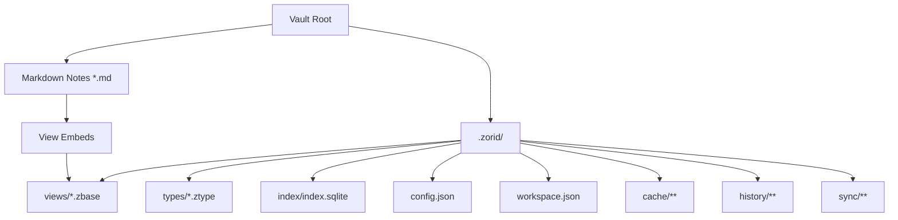

## Canonical user data

```text
*.md                          # Markdown notes (canonical)
*.zbase                       # View definitions (canonical, YAML)
.zorid/types/*.ztype          # Type definitions (canonical, YAML)
.zorid/config.json            # Settings
.zorid/workspace.json         # Workspace state
```

## Derived / disposable

```text
.zorid/index/index.sqlite     # Derived index, rebuildable
.zorid/cache/**               # Disposable
```

## Future / separate durable data

```text
.zorid/history/**             # Backup / timeline
.zorid/sync/**                # Operation logs (next stage)
.zorid/plugins/<plugin-id>/** # Plugin-private data
```

## Why not canonical SQLite for views?

A live SQLite file is awkward to sync through object storage (S3 / Google Drive) because conflicts happen at the whole-file level. Zorid view definitions are readable, sync-friendly, **conflict-detected text files** instead.

## Embedding views

Markdown uses normal embed syntax with the vault-relative `.zbase` path:

```md
Project dashboard

![[.zorid/views/project-tracker.zbase]]
```

`.zorid/views/` is only the default creation location. Users may store `.zbase` files anywhere in the vault:

```md
![[Dashboards/project-tracker.zbase]]
```

## Storage diagram



<Card title="Source" icon="github" href="https://github.com/zorid-app/Zorid/blob/main/docs/architecture/storage-model.md">
  Full storage model on GitHub.
</Card>